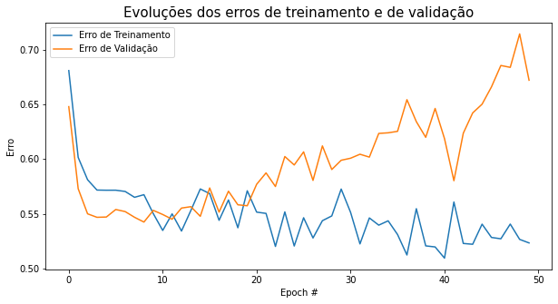
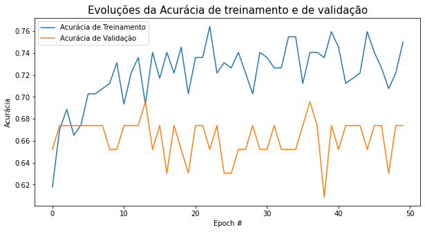
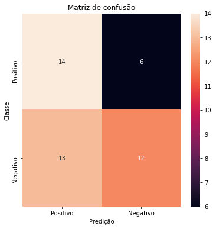
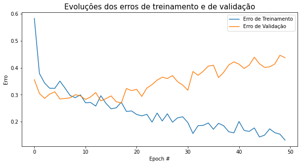
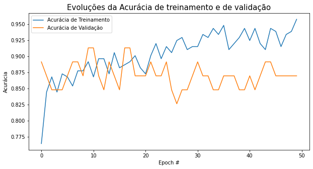
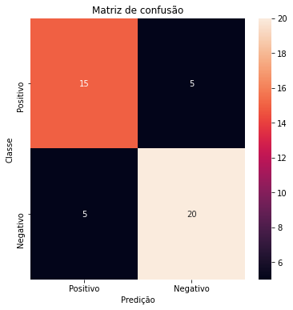

# Tarefa 1: Aprendizado Supervisionado

**Autor**: Matheus Jericó Palhares <br>
**LinkedIn**: https://linkedin.com/in/matheusjerico <br>
**Github**: https://github.com/matheusjerico

## 1) Tarefa:
**1. Utilizar apenas as colunas age, chol, thalach e target;** <br>
**2. Separar aleatoriamente e de forma equilibrada o dataset, utilizando 70% como conjunto de treinamento;**<br>
**3. Utilizar, também de forma equilibrada, 15% para validação e 15% para teste;**  <br>
**4. Implementar o processo de treinamento e validação do modelo, plotando as curvas com as evoluções dos erros de treinamento e de validação;**<br>
**5. Pesquisar a respeito de matrizes de confusão para classificação binária, gere uma relativa ao seu conjunto de testes e calcule o máximo de métricas que você julgar interessantes para avaliar seu modelo.**

### 1. Bibliotecas


```python
import numpy as np
import matplotlib.pyplot as plt
import pandas as pd
import random as rd
from sklearn.preprocessing import StandardScaler
from sklearn.model_selection import train_test_split
from sklearn.metrics import accuracy_score, classification_report, confusion_matrix, f1_score, roc_auc_score, precision_score
import tensorflow as tf
import seaborn as sns
```

### 2. Carregando dados


```python
dataset = pd.read_csv("./Dataset/heart.csv")
dataset.head()
```


<div>
<table border="1" class="dataframe">
  <thead>
    <tr style="text-align: right;">
      <th></th>
      <th>age</th>
      <th>sex</th>
      <th>cp</th>
      <th>trestbps</th>
      <th>chol</th>
      <th>fbs</th>
      <th>restecg</th>
      <th>thalach</th>
      <th>exang</th>
      <th>oldpeak</th>
      <th>slope</th>
      <th>ca</th>
      <th>thal</th>
      <th>target</th>
    </tr>
  </thead>
  <tbody>
    <tr>
      <th>0</th>
      <td>63</td>
      <td>1</td>
      <td>3</td>
      <td>145</td>
      <td>233</td>
      <td>1</td>
      <td>0</td>
      <td>150</td>
      <td>0</td>
      <td>2.3</td>
      <td>0</td>
      <td>0</td>
      <td>1</td>
      <td>1</td>
    </tr>
    <tr>
      <th>1</th>
      <td>37</td>
      <td>1</td>
      <td>2</td>
      <td>130</td>
      <td>250</td>
      <td>0</td>
      <td>1</td>
      <td>187</td>
      <td>0</td>
      <td>3.5</td>
      <td>0</td>
      <td>0</td>
      <td>2</td>
      <td>1</td>
    </tr>
    <tr>
      <th>2</th>
      <td>41</td>
      <td>0</td>
      <td>1</td>
      <td>130</td>
      <td>204</td>
      <td>0</td>
      <td>0</td>
      <td>172</td>
      <td>0</td>
      <td>1.4</td>
      <td>2</td>
      <td>0</td>
      <td>2</td>
      <td>1</td>
    </tr>
    <tr>
      <th>3</th>
      <td>56</td>
      <td>1</td>
      <td>1</td>
      <td>120</td>
      <td>236</td>
      <td>0</td>
      <td>1</td>
      <td>178</td>
      <td>0</td>
      <td>0.8</td>
      <td>2</td>
      <td>0</td>
      <td>2</td>
      <td>1</td>
    </tr>
    <tr>
      <th>4</th>
      <td>57</td>
      <td>0</td>
      <td>0</td>
      <td>120</td>
      <td>354</td>
      <td>0</td>
      <td>1</td>
      <td>163</td>
      <td>1</td>
      <td>0.6</td>
      <td>2</td>
      <td>0</td>
      <td>2</td>
      <td>1</td>
    </tr>
  </tbody>
</table>
</div>


```python
dataset.shape
```


    (303, 14)


### 3. Filtrando dados para o problema proposto


```python
df = dataset[['age', 'chol', 'thalach', 'target']].copy()
```


```python
df.head()
```


<div>
<table border="1" class="dataframe">
  <thead>
    <tr style="text-align: right;">
      <th></th>
      <th>age</th>
      <th>chol</th>
      <th>thalach</th>
      <th>target</th>
    </tr>
  </thead>
  <tbody>
    <tr>
      <th>0</th>
      <td>63</td>
      <td>233</td>
      <td>150</td>
      <td>1</td>
    </tr>
    <tr>
      <th>1</th>
      <td>37</td>
      <td>250</td>
      <td>187</td>
      <td>1</td>
    </tr>
    <tr>
      <th>2</th>
      <td>41</td>
      <td>204</td>
      <td>172</td>
      <td>1</td>
    </tr>
    <tr>
      <th>3</th>
      <td>56</td>
      <td>236</td>
      <td>178</td>
      <td>1</td>
    </tr>
    <tr>
      <th>4</th>
      <td>57</td>
      <td>354</td>
      <td>163</td>
      <td>1</td>
    </tr>
  </tbody>
</table>
</div>


```python
df.info()
```

    <class 'pandas.core.frame.DataFrame'>
    RangeIndex: 303 entries, 0 to 302
    Data columns (total 4 columns):
     #   Column   Non-Null Count  Dtype
    ---  ------   --------------  -----
     0   age      303 non-null    int64
     1   chol     303 non-null    int64
     2   thalach  303 non-null    int64
     3   target   303 non-null    int64
    dtypes: int64(4)
    memory usage: 9.6 KB


```python
df.describe()
```


<div>
<table border="1" class="dataframe">
  <thead>
    <tr style="text-align: right;">
      <th></th>
      <th>age</th>
      <th>chol</th>
      <th>thalach</th>
      <th>target</th>
    </tr>
  </thead>
  <tbody>
    <tr>
      <th>count</th>
      <td>303.000000</td>
      <td>303.000000</td>
      <td>303.000000</td>
      <td>303.000000</td>
    </tr>
    <tr>
      <th>mean</th>
      <td>54.366337</td>
      <td>246.264026</td>
      <td>149.646865</td>
      <td>0.544554</td>
    </tr>
    <tr>
      <th>std</th>
      <td>9.082101</td>
      <td>51.830751</td>
      <td>22.905161</td>
      <td>0.498835</td>
    </tr>
    <tr>
      <th>min</th>
      <td>29.000000</td>
      <td>126.000000</td>
      <td>71.000000</td>
      <td>0.000000</td>
    </tr>
    <tr>
      <th>25%</th>
      <td>47.500000</td>
      <td>211.000000</td>
      <td>133.500000</td>
      <td>0.000000</td>
    </tr>
    <tr>
      <th>50%</th>
      <td>55.000000</td>
      <td>240.000000</td>
      <td>153.000000</td>
      <td>1.000000</td>
    </tr>
    <tr>
      <th>75%</th>
      <td>61.000000</td>
      <td>274.500000</td>
      <td>166.000000</td>
      <td>1.000000</td>
    </tr>
    <tr>
      <th>max</th>
      <td>77.000000</td>
      <td>564.000000</td>
      <td>202.000000</td>
      <td>1.000000</td>
    </tr>
  </tbody>
</table>
</div>


### 3. Separando dados


```python
X = df.drop(columns='target')
y = df['target'].copy()
```


```python
X.head()
```


<div>
<table border="1" class="dataframe">
  <thead>
    <tr style="text-align: right;">
      <th></th>
      <th>age</th>
      <th>chol</th>
      <th>thalach</th>
    </tr>
  </thead>
  <tbody>
    <tr>
      <th>0</th>
      <td>63</td>
      <td>233</td>
      <td>150</td>
    </tr>
    <tr>
      <th>1</th>
      <td>37</td>
      <td>250</td>
      <td>187</td>
    </tr>
    <tr>
      <th>2</th>
      <td>41</td>
      <td>204</td>
      <td>172</td>
    </tr>
    <tr>
      <th>3</th>
      <td>56</td>
      <td>236</td>
      <td>178</td>
    </tr>
    <tr>
      <th>4</th>
      <td>57</td>
      <td>354</td>
      <td>163</td>
    </tr>
  </tbody>
</table>
</div>


```python
y.head()
```


    0    1
    1    1
    2    1
    3    1
    4    1
    Name: target, dtype: int64


### 4. Separando dados de treino, teste e validação


```python
X_train, X_test, y_train, y_test = train_test_split(X, y, test_size = 0.30, stratify=y, random_state = 43)
X_test, X_val, y_test, y_val = train_test_split(X_test, y_test, test_size = 0.5, stratify= y_test,random_state = 43)
```


```python
print(f"Quantidade de registros e dimensão X: {X.shape}")
print(f"Quantidade de registros e dimensão y: {y.shape}\n")
print(f"Quantidade de registros e dimensão X_train: {X_train.shape}")
print(f"Quantidade de registros e dimensão y_train: {y_train.shape}\n")
print(f"Quantidade de registros e dimensão X_test: {X_test.shape}")
print(f"Quantidade de registros e dimensão y_test: {y_test.shape}\n")
print(f"Quantidade de registros e dimensão X_val: {X_val.shape}")
print(f"Quantidade de registros e dimensão y_val: {y_val.shape}\n")
```

    Quantidade de registros e dimensão X: (303, 3)
    Quantidade de registros e dimensão y: (303,)
    
    Quantidade de registros e dimensão X_train: (212, 3)
    Quantidade de registros e dimensão y_train: (212,)
    
    Quantidade de registros e dimensão X_test: (45, 3)
    Quantidade de registros e dimensão y_test: (45,)
    
    Quantidade de registros e dimensão X_val: (46, 3)
    Quantidade de registros e dimensão y_val: (46,)
    


### 5. Criação do algoritmo


```python
def create_model(input_dim = 3):
    model = Sequential([
               tf.keras.layers.Dense(units=16, 
                                     activation = 'relu', 
                                     kernel_initializer = 'normal',
                                     input_dim=input_dim),
               tf.keras.layers.Dropout(0.2),
               tf.keras.layers.Dense(units=16,
                                     activation = 'relu',
                                     kernel_initializer = 'normal'),
               tf.keras.layers.Dropout(0.2),
               tf.keras.layers.Dense(units=1, activation = 'sigmoid')])

    return model
```


```python
model = create_model(input_dim=3)
otimizador = tf.keras.optimizers.Adam(lr = 0.01, decay = 0.0001, clipvalue = 0.5)
```

### 6. Normalizando os dados


```python
scaler = StandardScaler().fit(X_train)
X_train = scaler.transform(X_train)
X_test = scaler.transform(X_test)
X_val = scaler.transform(X_val)
```

### 6. Treinamento do algoritmo


```python
model.compile(optimizer = otimizador, loss = 'binary_crossentropy',
                      metrics = ['binary_accuracy'])
```


```python
model.summary()
```

    Model: "sequential"
    _________________________________________________________________
    Layer (type)                 Output Shape              Param #   
    =================================================================
    dense (Dense)                (None, 16)                64        
    _________________________________________________________________
    dropout (Dropout)            (None, 16)                0         
    _________________________________________________________________
    dense_1 (Dense)              (None, 16)                272       
    _________________________________________________________________
    dropout_1 (Dropout)          (None, 16)                0         
    _________________________________________________________________
    dense_2 (Dense)              (None, 1)                 17        
    =================================================================
    Total params: 353
    Trainable params: 353
    Non-trainable params: 0
    _________________________________________________________________


```python
EPOCHS = 50
BS = 12

H = model.fit(X_train, y_train,
              validation_data=(X_val, y_val),
              epochs = EPOCHS, 
              batch_size = BS,      
              shuffle=True)
```

    Train on 212 samples, validate on 46 samples
    Epoch 1/50
    212/212 [==============================] - 1s 6ms/sample - loss: 0.6809 - binary_accuracy: 0.6179 - val_loss: 0.6479 - val_binary_accuracy: 0.6522
    Epoch 2/50
    212/212 [==============================] - 0s 756us/sample - loss: 0.6015 - binary_accuracy: 0.6698 - val_loss: 0.5729 - val_binary_accuracy: 0.6739
    Epoch 3/50
    212/212 [==============================] - 0s 677us/sample - loss: 0.5811 - binary_accuracy: 0.6887 - val_loss: 0.5499 - val_binary_accuracy: 0.6739
    Epoch 4/50
    212/212 [==============================] - 0s 807us/sample - loss: 0.5716 - binary_accuracy: 0.6651 - val_loss: 0.5467 - val_binary_accuracy: 0.6739
    Epoch 5/50
    212/212 [==============================] - 0s 545us/sample - loss: 0.5715 - binary_accuracy: 0.6745 - val_loss: 0.5470 - val_binary_accuracy: 0.6739
    Epoch 6/50
    212/212 [==============================] - 0s 690us/sample - loss: 0.5715 - binary_accuracy: 0.7028 - val_loss: 0.5538 - val_binary_accuracy: 0.6739
    Epoch 7/50
    212/212 [==============================] - 0s 820us/sample - loss: 0.5704 - binary_accuracy: 0.7028 - val_loss: 0.5520 - val_binary_accuracy: 0.6739
    Epoch 8/50
    212/212 [==============================] - 0s 584us/sample - loss: 0.5650 - binary_accuracy: 0.7075 - val_loss: 0.5467 - val_binary_accuracy: 0.6739
    Epoch 9/50
    212/212 [==============================] - 0s 720us/sample - loss: 0.5674 - binary_accuracy: 0.7123 - val_loss: 0.5424 - val_binary_accuracy: 0.6522
    Epoch 10/50
    212/212 [==============================] - 0s 625us/sample - loss: 0.5500 - binary_accuracy: 0.7311 - val_loss: 0.5530 - val_binary_accuracy: 0.6522
    Epoch 11/50
    212/212 [==============================] - 0s 769us/sample - loss: 0.5347 - binary_accuracy: 0.6934 - val_loss: 0.5493 - val_binary_accuracy: 0.6739
    Epoch 12/50
    212/212 [==============================] - 0s 568us/sample - loss: 0.5499 - binary_accuracy: 0.7217 - val_loss: 0.5449 - val_binary_accuracy: 0.6739
    Epoch 13/50
    212/212 [==============================] - 0s 509us/sample - loss: 0.5342 - binary_accuracy: 0.7358 - val_loss: 0.5552 - val_binary_accuracy: 0.6739
    Epoch 14/50
    212/212 [==============================] - 0s 523us/sample - loss: 0.5530 - binary_accuracy: 0.6934 - val_loss: 0.5564 - val_binary_accuracy: 0.6957
    Epoch 15/50
    212/212 [==============================] - 0s 649us/sample - loss: 0.5726 - binary_accuracy: 0.7406 - val_loss: 0.5476 - val_binary_accuracy: 0.6522
    Epoch 16/50
    212/212 [==============================] - 0s 521us/sample - loss: 0.5684 - binary_accuracy: 0.7170 - val_loss: 0.5735 - val_binary_accuracy: 0.6739
    Epoch 17/50
    212/212 [==============================] - 0s 608us/sample - loss: 0.5440 - binary_accuracy: 0.7406 - val_loss: 0.5515 - val_binary_accuracy: 0.6304
    Epoch 18/50
    212/212 [==============================] - 0s 623us/sample - loss: 0.5626 - binary_accuracy: 0.7217 - val_loss: 0.5706 - val_binary_accuracy: 0.6739
    Epoch 19/50
    212/212 [==============================] - 0s 760us/sample - loss: 0.5371 - binary_accuracy: 0.7453 - val_loss: 0.5582 - val_binary_accuracy: 0.6522
    Epoch 20/50
    212/212 [==============================] - 0s 521us/sample - loss: 0.5710 - binary_accuracy: 0.7028 - val_loss: 0.5573 - val_binary_accuracy: 0.6304
    Epoch 21/50
    212/212 [==============================] - 0s 597us/sample - loss: 0.5515 - binary_accuracy: 0.7358 - val_loss: 0.5769 - val_binary_accuracy: 0.6739
    Epoch 22/50
    212/212 [==============================] - 0s 642us/sample - loss: 0.5503 - binary_accuracy: 0.7358 - val_loss: 0.5873 - val_binary_accuracy: 0.6739
    Epoch 23/50
    212/212 [==============================] - 0s 637us/sample - loss: 0.5201 - binary_accuracy: 0.7642 - val_loss: 0.5749 - val_binary_accuracy: 0.6522
    Epoch 24/50
    212/212 [==============================] - 0s 615us/sample - loss: 0.5517 - binary_accuracy: 0.7217 - val_loss: 0.6023 - val_binary_accuracy: 0.6739
    Epoch 25/50
    212/212 [==============================] - 0s 611us/sample - loss: 0.5205 - binary_accuracy: 0.7311 - val_loss: 0.5946 - val_binary_accuracy: 0.6304
    Epoch 26/50
    212/212 [==============================] - 0s 625us/sample - loss: 0.5463 - binary_accuracy: 0.7264 - val_loss: 0.6066 - val_binary_accuracy: 0.6304
    Epoch 27/50
    212/212 [==============================] - 0s 647us/sample - loss: 0.5278 - binary_accuracy: 0.7406 - val_loss: 0.5805 - val_binary_accuracy: 0.6522
    Epoch 28/50
    212/212 [==============================] - 0s 475us/sample - loss: 0.5436 - binary_accuracy: 0.7217 - val_loss: 0.6120 - val_binary_accuracy: 0.6522
    Epoch 29/50
    212/212 [==============================] - 0s 584us/sample - loss: 0.5480 - binary_accuracy: 0.7028 - val_loss: 0.5904 - val_binary_accuracy: 0.6739
    Epoch 30/50
    212/212 [==============================] - 0s 625us/sample - loss: 0.5726 - binary_accuracy: 0.7406 - val_loss: 0.5989 - val_binary_accuracy: 0.6522
    Epoch 31/50
    212/212 [==============================] - 0s 419us/sample - loss: 0.5513 - binary_accuracy: 0.7358 - val_loss: 0.6007 - val_binary_accuracy: 0.6522
    Epoch 32/50
    212/212 [==============================] - 0s 410us/sample - loss: 0.5224 - binary_accuracy: 0.7264 - val_loss: 0.6044 - val_binary_accuracy: 0.6739
    Epoch 33/50
    212/212 [==============================] - 0s 635us/sample - loss: 0.5461 - binary_accuracy: 0.7264 - val_loss: 0.6018 - val_binary_accuracy: 0.6522
    Epoch 34/50
    212/212 [==============================] - 0s 717us/sample - loss: 0.5395 - binary_accuracy: 0.7547 - val_loss: 0.6234 - val_binary_accuracy: 0.6522
    Epoch 35/50
    212/212 [==============================] - 0s 607us/sample - loss: 0.5435 - binary_accuracy: 0.7547 - val_loss: 0.6240 - val_binary_accuracy: 0.6522
    Epoch 36/50
    212/212 [==============================] - 0s 543us/sample - loss: 0.5310 - binary_accuracy: 0.7123 - val_loss: 0.6253 - val_binary_accuracy: 0.6739
    Epoch 37/50
    212/212 [==============================] - 0s 560us/sample - loss: 0.5123 - binary_accuracy: 0.7406 - val_loss: 0.6543 - val_binary_accuracy: 0.6957
    Epoch 38/50
    212/212 [==============================] - 0s 574us/sample - loss: 0.5546 - binary_accuracy: 0.7406 - val_loss: 0.6342 - val_binary_accuracy: 0.6739
    Epoch 39/50
    212/212 [==============================] - 0s 414us/sample - loss: 0.5206 - binary_accuracy: 0.7358 - val_loss: 0.6199 - val_binary_accuracy: 0.6087
    Epoch 40/50
    212/212 [==============================] - 0s 586us/sample - loss: 0.5196 - binary_accuracy: 0.7594 - val_loss: 0.6463 - val_binary_accuracy: 0.6739
    Epoch 41/50
    212/212 [==============================] - 0s 506us/sample - loss: 0.5094 - binary_accuracy: 0.7453 - val_loss: 0.6186 - val_binary_accuracy: 0.6522
    Epoch 42/50
    212/212 [==============================] - 0s 464us/sample - loss: 0.5607 - binary_accuracy: 0.7123 - val_loss: 0.5802 - val_binary_accuracy: 0.6739
    Epoch 43/50
    212/212 [==============================] - 0s 586us/sample - loss: 0.5228 - binary_accuracy: 0.7170 - val_loss: 0.6236 - val_binary_accuracy: 0.6739
    Epoch 44/50
    212/212 [==============================] - 0s 555us/sample - loss: 0.5221 - binary_accuracy: 0.7217 - val_loss: 0.6422 - val_binary_accuracy: 0.6739
    Epoch 45/50
    212/212 [==============================] - 0s 610us/sample - loss: 0.5405 - binary_accuracy: 0.7594 - val_loss: 0.6502 - val_binary_accuracy: 0.6522
    Epoch 46/50
    212/212 [==============================] - 0s 584us/sample - loss: 0.5283 - binary_accuracy: 0.7406 - val_loss: 0.6660 - val_binary_accuracy: 0.6739
    Epoch 47/50
    212/212 [==============================] - 0s 580us/sample - loss: 0.5271 - binary_accuracy: 0.7264 - val_loss: 0.6856 - val_binary_accuracy: 0.6739
    Epoch 48/50
    212/212 [==============================] - 0s 702us/sample - loss: 0.5405 - binary_accuracy: 0.7075 - val_loss: 0.6838 - val_binary_accuracy: 0.6304
    Epoch 49/50
    212/212 [==============================] - 0s 483us/sample - loss: 0.5265 - binary_accuracy: 0.7217 - val_loss: 0.7144 - val_binary_accuracy: 0.6739
    Epoch 50/50
    212/212 [==============================] - 0s 605us/sample - loss: 0.5233 - binary_accuracy: 0.7500 - val_loss: 0.6721 - val_binary_accuracy: 0.6739


### 7. Predição


```python
y_pred = model.predict_classes(X_test)
```

### 8. Gráfico de evolução de métricas de treinamento


```python
N = 50
plt.figure(figsize = (10,5))
plt.plot(np.arange(0, N), H.history["loss"], label="Erro de Treinamento")
plt.plot(np.arange(0, N), H.history["val_loss"], label="Erro de Validação")
plt.title("Evoluções dos erros de treinamento e de validação", size=15)
plt.xlabel("Epoch #")
plt.ylabel("Erro")
plt.legend(loc="best", prop={"size": 10})
```


    <matplotlib.legend.Legend at 0x7f9e64f197f0>





```python
N = 50
plt.figure(figsize = (10,5))
plt.plot(np.arange(0, N), H.history["binary_accuracy"], label="Acurácia de Treinamento")
plt.plot(np.arange(0, N), H.history["val_binary_accuracy"], label="Acurácia de Validação")
plt.title("Evoluções da Acurácia de treinamento e de validação", size=15)
plt.xlabel("Epoch #")
plt.ylabel("Acurácia")
plt.legend(loc="best", prop={"size": 10})
```


    <matplotlib.legend.Legend at 0x7f9e64a42cf8>





### 9. Métricas

#### 9.1. Matriz de Confusão


```python
LABELS = ["Positivo", "Negativo"]
conf_matrix = confusion_matrix(y_test, y_pred)

plt.figure(figsize=(6, 6))
sns.heatmap(conf_matrix, xticklabels=LABELS, yticklabels=LABELS, annot=True, fmt="d");
plt.title("Matriz de confusão")
plt.ylabel('Classe')
plt.xlabel('Predição')
plt.show()
```





#### 9.2. Precision & Accuracy


```python
print(f'Precision: {precision_score(y_test, y_pred)}')
```

    Precision: 0.6666666666666666


```python
print(f'Accuracy: {accuracy_score(y_test, y_pred)}')
```

    Accuracy: 0.5777777777777777


#### 9.3. ROC AUC


```python
roc_auc_score(y_test, y_pred)
```


    0.59


#### 9.4. F1-Score


```python
print(f'Accuracy: {f1_score(y_test, y_pred)}') 
```

    Accuracy: 0.5581395348837209


#### 9.5. Tudo junto & Misturado (Precision, Recall e F1-score)


```python
print(classification_report(y_test, y_pred))
```

                  precision    recall  f1-score   support
    
               0       0.52      0.70      0.60        20
               1       0.67      0.48      0.56        25
    
        accuracy                           0.58        45
       macro avg       0.59      0.59      0.58        45
    weighted avg       0.60      0.58      0.57        45
    


# DESAFIO
**Utilizando todos os dados do dataset**

### 1. Separação dos dados


```python
df = dataset.copy()
```


```python
X = df.drop(columns='target')
y = df['target'].copy()
```


```python
X.head()
```


<div>
<table border="1" class="dataframe">
  <thead>
    <tr style="text-align: right;">
      <th></th>
      <th>age</th>
      <th>sex</th>
      <th>cp</th>
      <th>trestbps</th>
      <th>chol</th>
      <th>fbs</th>
      <th>restecg</th>
      <th>thalach</th>
      <th>exang</th>
      <th>oldpeak</th>
      <th>slope</th>
      <th>ca</th>
      <th>thal</th>
    </tr>
  </thead>
  <tbody>
    <tr>
      <th>0</th>
      <td>63</td>
      <td>1</td>
      <td>3</td>
      <td>145</td>
      <td>233</td>
      <td>1</td>
      <td>0</td>
      <td>150</td>
      <td>0</td>
      <td>2.3</td>
      <td>0</td>
      <td>0</td>
      <td>1</td>
    </tr>
    <tr>
      <th>1</th>
      <td>37</td>
      <td>1</td>
      <td>2</td>
      <td>130</td>
      <td>250</td>
      <td>0</td>
      <td>1</td>
      <td>187</td>
      <td>0</td>
      <td>3.5</td>
      <td>0</td>
      <td>0</td>
      <td>2</td>
    </tr>
    <tr>
      <th>2</th>
      <td>41</td>
      <td>0</td>
      <td>1</td>
      <td>130</td>
      <td>204</td>
      <td>0</td>
      <td>0</td>
      <td>172</td>
      <td>0</td>
      <td>1.4</td>
      <td>2</td>
      <td>0</td>
      <td>2</td>
    </tr>
    <tr>
      <th>3</th>
      <td>56</td>
      <td>1</td>
      <td>1</td>
      <td>120</td>
      <td>236</td>
      <td>0</td>
      <td>1</td>
      <td>178</td>
      <td>0</td>
      <td>0.8</td>
      <td>2</td>
      <td>0</td>
      <td>2</td>
    </tr>
    <tr>
      <th>4</th>
      <td>57</td>
      <td>0</td>
      <td>0</td>
      <td>120</td>
      <td>354</td>
      <td>0</td>
      <td>1</td>
      <td>163</td>
      <td>1</td>
      <td>0.6</td>
      <td>2</td>
      <td>0</td>
      <td>2</td>
    </tr>
  </tbody>
</table>
</div>


```python
X_train, X_test, y_train, y_test = train_test_split(X, y, test_size = 0.30, stratify=y, random_state = 43)
X_test, X_val, y_test, y_val = train_test_split(X_test, y_test, test_size = 0.5, stratify= y_test,random_state = 43)
```

### 2. Criação do modelo


```python
model = create_model(input_dim=13)
otimizador = tf.keras.optimizers.Adam(lr = 0.01, decay = 0.0001, clipvalue = 0.5)
```

### 3. Normalizando


```python
scaler = StandardScaler().fit(X_train)
X_train = scaler.transform(X_train)
X_test = scaler.transform(X_test)
X_val = scaler.transform(X_val)
```

### 4. Treinamento


```python
model.compile(optimizer = otimizador, loss = 'binary_crossentropy',
                      metrics = ['binary_accuracy'])
```


```python
EPOCHS = 50
BS = 12

H = model.fit(X_train, y_train,
              validation_data=(X_val, y_val),
              epochs = EPOCHS, 
              batch_size = BS,      
              shuffle=True)
```

    Train on 212 samples, validate on 46 samples
    Epoch 1/50
    212/212 [==============================] - 1s 5ms/sample - loss: 0.5833 - binary_accuracy: 0.7642 - val_loss: 0.3558 - val_binary_accuracy: 0.8913
    Epoch 2/50
    212/212 [==============================] - 0s 602us/sample - loss: 0.3786 - binary_accuracy: 0.8443 - val_loss: 0.3046 - val_binary_accuracy: 0.8696
    Epoch 3/50
    212/212 [==============================] - 0s 517us/sample - loss: 0.3437 - binary_accuracy: 0.8679 - val_loss: 0.2864 - val_binary_accuracy: 0.8478
    Epoch 4/50
    212/212 [==============================] - 0s 597us/sample - loss: 0.3241 - binary_accuracy: 0.8443 - val_loss: 0.3022 - val_binary_accuracy: 0.8478
    Epoch 5/50
    212/212 [==============================] - 0s 582us/sample - loss: 0.3236 - binary_accuracy: 0.8726 - val_loss: 0.3110 - val_binary_accuracy: 0.8478
    Epoch 6/50
    212/212 [==============================] - 0s 520us/sample - loss: 0.3506 - binary_accuracy: 0.8679 - val_loss: 0.2842 - val_binary_accuracy: 0.8696
    Epoch 7/50
    212/212 [==============================] - 0s 806us/sample - loss: 0.3246 - binary_accuracy: 0.8538 - val_loss: 0.2860 - val_binary_accuracy: 0.8913
    Epoch 8/50
    212/212 [==============================] - 0s 625us/sample - loss: 0.2971 - binary_accuracy: 0.8774 - val_loss: 0.2885 - val_binary_accuracy: 0.8913
    Epoch 9/50
    212/212 [==============================] - 0s 534us/sample - loss: 0.2891 - binary_accuracy: 0.8774 - val_loss: 0.3000 - val_binary_accuracy: 0.8696
    Epoch 10/50
    212/212 [==============================] - 0s 497us/sample - loss: 0.2996 - binary_accuracy: 0.8915 - val_loss: 0.2959 - val_binary_accuracy: 0.9130
    Epoch 11/50
    212/212 [==============================] - 0s 641us/sample - loss: 0.2701 - binary_accuracy: 0.8679 - val_loss: 0.2824 - val_binary_accuracy: 0.9130
    Epoch 12/50
    212/212 [==============================] - 0s 561us/sample - loss: 0.2710 - binary_accuracy: 0.8962 - val_loss: 0.2919 - val_binary_accuracy: 0.8696
    Epoch 13/50
    212/212 [==============================] - 0s 556us/sample - loss: 0.2579 - binary_accuracy: 0.8962 - val_loss: 0.3080 - val_binary_accuracy: 0.8478
    Epoch 14/50
    212/212 [==============================] - 0s 630us/sample - loss: 0.2963 - binary_accuracy: 0.8726 - val_loss: 0.2771 - val_binary_accuracy: 0.8913
    Epoch 15/50
    212/212 [==============================] - 0s 686us/sample - loss: 0.2680 - binary_accuracy: 0.9057 - val_loss: 0.2855 - val_binary_accuracy: 0.8696
    Epoch 16/50
    212/212 [==============================] - 0s 623us/sample - loss: 0.2477 - binary_accuracy: 0.8821 - val_loss: 0.2957 - val_binary_accuracy: 0.8478
    Epoch 17/50
    212/212 [==============================] - 0s 588us/sample - loss: 0.2513 - binary_accuracy: 0.8868 - val_loss: 0.2741 - val_binary_accuracy: 0.9130
    Epoch 18/50
    212/212 [==============================] - 0s 645us/sample - loss: 0.2722 - binary_accuracy: 0.8915 - val_loss: 0.2689 - val_binary_accuracy: 0.9130
    Epoch 19/50
    212/212 [==============================] - 0s 623us/sample - loss: 0.2380 - binary_accuracy: 0.9009 - val_loss: 0.3231 - val_binary_accuracy: 0.8696
    Epoch 20/50
    212/212 [==============================] - 0s 575us/sample - loss: 0.2398 - binary_accuracy: 0.8821 - val_loss: 0.3153 - val_binary_accuracy: 0.8696
    Epoch 21/50
    212/212 [==============================] - 0s 430us/sample - loss: 0.2268 - binary_accuracy: 0.8726 - val_loss: 0.3201 - val_binary_accuracy: 0.8696
    Epoch 22/50
    212/212 [==============================] - 0s 615us/sample - loss: 0.2215 - binary_accuracy: 0.9009 - val_loss: 0.2936 - val_binary_accuracy: 0.8913
    Epoch 23/50
    212/212 [==============================] - 0s 647us/sample - loss: 0.2272 - binary_accuracy: 0.9198 - val_loss: 0.3248 - val_binary_accuracy: 0.8696
    Epoch 24/50
    212/212 [==============================] - 0s 738us/sample - loss: 0.1984 - binary_accuracy: 0.8962 - val_loss: 0.3375 - val_binary_accuracy: 0.8696
    Epoch 25/50
    212/212 [==============================] - 0s 718us/sample - loss: 0.2319 - binary_accuracy: 0.9151 - val_loss: 0.3542 - val_binary_accuracy: 0.8913
    Epoch 26/50
    212/212 [==============================] - 0s 509us/sample - loss: 0.2025 - binary_accuracy: 0.9057 - val_loss: 0.3650 - val_binary_accuracy: 0.8478
    Epoch 27/50
    212/212 [==============================] - 0s 542us/sample - loss: 0.2292 - binary_accuracy: 0.9245 - val_loss: 0.3601 - val_binary_accuracy: 0.8261
    Epoch 28/50
    212/212 [==============================] - 0s 469us/sample - loss: 0.1980 - binary_accuracy: 0.9292 - val_loss: 0.3710 - val_binary_accuracy: 0.8478
    Epoch 29/50
    212/212 [==============================] - 0s 649us/sample - loss: 0.2142 - binary_accuracy: 0.9104 - val_loss: 0.3482 - val_binary_accuracy: 0.8478
    Epoch 30/50
    212/212 [==============================] - 0s 597us/sample - loss: 0.2181 - binary_accuracy: 0.9151 - val_loss: 0.3359 - val_binary_accuracy: 0.8696
    Epoch 31/50
    212/212 [==============================] - 0s 622us/sample - loss: 0.1969 - binary_accuracy: 0.9151 - val_loss: 0.3166 - val_binary_accuracy: 0.8913
    Epoch 32/50
    212/212 [==============================] - 0s 644us/sample - loss: 0.1560 - binary_accuracy: 0.9340 - val_loss: 0.3861 - val_binary_accuracy: 0.8696
    Epoch 33/50
    212/212 [==============================] - 0s 580us/sample - loss: 0.1852 - binary_accuracy: 0.9292 - val_loss: 0.3721 - val_binary_accuracy: 0.8696
    Epoch 34/50
    212/212 [==============================] - 0s 531us/sample - loss: 0.1863 - binary_accuracy: 0.9434 - val_loss: 0.3869 - val_binary_accuracy: 0.8478
    Epoch 35/50
    212/212 [==============================] - 0s 505us/sample - loss: 0.1952 - binary_accuracy: 0.9340 - val_loss: 0.4059 - val_binary_accuracy: 0.8478
    Epoch 36/50
    212/212 [==============================] - 0s 687us/sample - loss: 0.1718 - binary_accuracy: 0.9481 - val_loss: 0.4096 - val_binary_accuracy: 0.8696
    Epoch 37/50
    212/212 [==============================] - 0s 729us/sample - loss: 0.1939 - binary_accuracy: 0.9104 - val_loss: 0.3636 - val_binary_accuracy: 0.8696
    Epoch 38/50
    212/212 [==============================] - 0s 678us/sample - loss: 0.1850 - binary_accuracy: 0.9198 - val_loss: 0.3830 - val_binary_accuracy: 0.8696
    Epoch 39/50
    212/212 [==============================] - 0s 549us/sample - loss: 0.1626 - binary_accuracy: 0.9292 - val_loss: 0.4103 - val_binary_accuracy: 0.8478
    Epoch 40/50
    212/212 [==============================] - 0s 512us/sample - loss: 0.1584 - binary_accuracy: 0.9434 - val_loss: 0.4220 - val_binary_accuracy: 0.8478
    Epoch 41/50
    212/212 [==============================] - 0s 566us/sample - loss: 0.2007 - binary_accuracy: 0.9245 - val_loss: 0.4135 - val_binary_accuracy: 0.8696
    Epoch 42/50
    212/212 [==============================] - 0s 396us/sample - loss: 0.1675 - binary_accuracy: 0.9434 - val_loss: 0.3975 - val_binary_accuracy: 0.8478
    Epoch 43/50
    212/212 [==============================] - 0s 239us/sample - loss: 0.1638 - binary_accuracy: 0.9198 - val_loss: 0.4100 - val_binary_accuracy: 0.8696
    Epoch 44/50
    212/212 [==============================] - 0s 232us/sample - loss: 0.1767 - binary_accuracy: 0.9104 - val_loss: 0.4392 - val_binary_accuracy: 0.8913
    Epoch 45/50
    212/212 [==============================] - 0s 227us/sample - loss: 0.1431 - binary_accuracy: 0.9434 - val_loss: 0.4148 - val_binary_accuracy: 0.8913
    Epoch 46/50
    212/212 [==============================] - 0s 276us/sample - loss: 0.1500 - binary_accuracy: 0.9387 - val_loss: 0.4015 - val_binary_accuracy: 0.8696
    Epoch 47/50
    212/212 [==============================] - 0s 611us/sample - loss: 0.1734 - binary_accuracy: 0.9151 - val_loss: 0.4034 - val_binary_accuracy: 0.8696
    Epoch 48/50
    212/212 [==============================] - 0s 700us/sample - loss: 0.1590 - binary_accuracy: 0.9340 - val_loss: 0.4142 - val_binary_accuracy: 0.8696
    Epoch 49/50
    212/212 [==============================] - 0s 644us/sample - loss: 0.1535 - binary_accuracy: 0.9387 - val_loss: 0.4466 - val_binary_accuracy: 0.8696
    Epoch 50/50
    212/212 [==============================] - 0s 712us/sample - loss: 0.1316 - binary_accuracy: 0.9575 - val_loss: 0.4373 - val_binary_accuracy: 0.8696


### 5. Predição


```python
y_pred = model.predict_classes(X_test)
```

### 6. Gráfico de evolução de métricas de treinamento


```python
N = 50
plt.figure(figsize = (10,5))
plt.plot(np.arange(0, N), H.history["loss"], label="Erro de Treinamento")
plt.plot(np.arange(0, N), H.history["val_loss"], label="Erro de Validação")
plt.title("Evoluções dos erros de treinamento e de validação", size=15)
plt.xlabel("Epoch #")
plt.ylabel("Erro")
plt.legend(loc="best", prop={"size": 10})
```


    <matplotlib.legend.Legend at 0x7f9e644bfda0>





```python
N = 50
plt.figure(figsize = (10,5))
plt.plot(np.arange(0, N), H.history["binary_accuracy"], label="Acurácia de Treinamento")
plt.plot(np.arange(0, N), H.history["val_binary_accuracy"], label="Acurácia de Validação")
plt.title("Evoluções da Acurácia de treinamento e de validação", size=15)
plt.xlabel("Epoch #")
plt.ylabel("Acurácia")
plt.legend(loc="best", prop={"size": 10})
```


    <matplotlib.legend.Legend at 0x7f9e64492cc0>





### 7. Métricas


```python
LABELS = ["Positivo", "Negativo"]
conf_matrix = confusion_matrix(y_test, y_pred)

plt.figure(figsize=(6, 6))
sns.heatmap(conf_matrix, xticklabels=LABELS, yticklabels=LABELS, annot=True, fmt="d");
plt.title("Matriz de confusão")
plt.ylabel('Classe')
plt.xlabel('Predição')
plt.show()
```





```python
print(classification_report(y_test, y_pred))
```

                  precision    recall  f1-score   support
    
               0       0.75      0.75      0.75        20
               1       0.80      0.80      0.80        25
    
        accuracy                           0.78        45
       macro avg       0.78      0.78      0.78        45
    weighted avg       0.78      0.78      0.78        45
    


```python
print(f'Accuracy: {accuracy_score(y_test, y_pred)}')
```

    Accuracy: 0.7777777777777778


**Análise:** 
- O desempenho melhorou consideravelmente analisando a matriz de confusão, acurácia, recall e f1-score.
- O incremento na quantidade de features mostrou melhorar o desempenho do modelo de redes neurais.  
